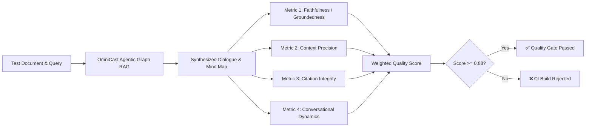

# 🧪 AI Quality, Grounding & Evaluation Rubric (EVALUATION_RUBRIC.md)
## Project: OmniCast Studio
**Document Version:** 1.0.0  
**Framework Alignment:** DeepEval, Ragas (RAG Triad), G-Eval (LLM-as-a-Judge)  
**CI Enforcement Gate:** Automated pre-merge test suite  

---

## 1. Evaluation Philosophy

For a multimodal research and synthesis engine, traditional code unit tests are necessary but insufficient. An LLM that compiles and outputs JSON can still hallucinate non-existent authors, misattribute experimental results, or generate disjointed, robotic dialogue.

OmniCast Studio enforces **Continuous AI Quality Gates**: every build is evaluated against formal mathematical and semantic evaluation rubrics.



---

## 2. Quantitative Metric Rubric & Hard Gates

| Metric Name | Mathematical Definition / Methodology | Minimum Threshold | Target SLA | CI Gate Action |
| :--- | :--- | :--- | :--- | :--- |
| **Faithfulness / Groundedness** | $\frac{|\text{Verified Claims Supported by Source}|}{|\text{Total Claims Made in Dialogue}|}$ via NLI | **$\ge 0.90$** | $\ge 0.96$ | **BLOCK PR:** Fails build if hallucination detected |
| **Context Precision** | $\sum_{k=1}^K (\text{Precision}@k \times v_k) / |\text{Relevant Chunks}|$ | **$\ge 0.85$** | $\ge 0.92$ | **BLOCK PR:** Fails build if irrelevant chunks injected |
| **Citation Integrity** | $\frac{|\text{Citations Matching Valid Document Page/Offset}|}{|\text{Total Citations Generated}|}$ | **$100\%$** | $100\%$ | **BLOCK PR:** Rejects any phantom citations |
| **Speaker Turn Balance** | Ratio of Host A speaking duration to total dialogue: $\frac{t_{\text{Host A}}}{t_{\text{Total}}}$ | **$40\% \le \text{Ratio} \le 60\%$** | $50 \pm 5\%$ | **WARN:** Flags monologue bias in dialogue |
| **Banter & Naturalness** | G-Eval 5-point rubric measuring conversational flow, natural fillers, and realistic transitions | **$\ge 4.0 / 5.0$** | $\ge 4.6 / 5.0$ | **WARN:** Prompts dialogue scripter retry |
| **Voice Roundtrip Latency** | Time from client VAD speech cutoff to first audio packet arriving at client | **$p95 \le 350\text{ms}$** | $p50 \le 250\text{ms}$ | **BLOCK PR:** Rejects streaming audio regressions |

---

## 3. G-Eval Dialogue Naturalness Criteria

The dialogue generation engine is judged on a 5-point Likert scale across four distinct conversational dimensions:

### 1. Conversational Flow & Interactivity (Weight: 35%)
* **Score 5:** Seamless handoffs between Host A and Host B; hosts build upon each other's points, ask clarifying follow-ups, and react with authentic conversational cadence (*"Wait, are you saying...?"*, *"Exactly, but look at the trade-off"*).
* **Score 3:** Functional turn-taking, but feels like two independent monologues spliced together.
* **Score 1:** Repetitive phrasing, robotic recitation of bullet points, or one host dominating the entire conversation.

### 2. Pedagogical Clarity (Weight: 25%)
* **Score 5:** Translates complex equations and dense architectural jargon into intuitive, relatable analogies without sacrificing technical precision.
* **Score 3:** Technically accurate but dry; reads like a textbook being read aloud.
* **Score 1:** Incomprehensible or oversimplified to the point of factual error.

### 3. Audio Pacing & Silence Distribution (Weight: 20%)
* **Score 5:** Appropriate pause lengths between turns ($200\text{ms}–400\text{ms}$); natural laughter and agreement markers placed appropriately.
* **Score 1:** Unnatural pauses ($> 1\text{s}$) or continuous, breathless speech causing cognitive overload.

### 4. Grounded Citation Accuracy (Weight: 20%)
* **Score 5:** Every specific numerical claim, author attribution, and technical trade-off is tied to a precise source citation.
* **Score 1:** Unsubstantiated claims, incorrect statistics, or fabricated dates.

---

## 4. Golden Evaluation Benchmark Suite (`tests/evals/golden_benchmark.json`)

The automated CI evaluation runs against a curated suite of 10 multi-domain benchmark documents:

1. **Academic Computer Science:** Transformer Attention Optimization & FlashAttention-3 paper.
2. **Medical Research:** Clinical Trial protocol on immunotherapy with dense statistical tables.
3. **Legal Contract:** Commercial Office Lease with complex escalation schedules and break clauses.
4. **Financial Earnings Call:** 40-page quarterly report with GAAP/Non-GAAP reconciliation.
5. **System Architecture PRD:** Distributed banking ledger requirements with ACID invariants.
6. **Hardware Engineering:** Microcontroller schematic overview and timing diagrams.
7. **Cybersecurity Advisory:** Zero-day CVE vulnerability disclosure and mitigation steps.
8. **Bioinformatics Paper:** Protein folding analysis and MSA alignments.
9. **Regulatory Compliance:** HIPAA Security Rule and audit requirements documentation.
10. **Open Source Codebase:** Architecture overview of an Apache distributed proxy.

---

## 5. Automated CI Execution Script

Every pull request executes the evaluation harness via `pytest`:

```bash
# Executed automatically in GitHub Actions on pull requests:
pytest services/core-api/tests/test_evals.py -v --eval-benchmark=golden
```

If the aggregated Faithfulness score falls below **0.90** or any citation fails verification, the GitHub Actions check status is marked as **FAILED**, blocking merge into `main`.
