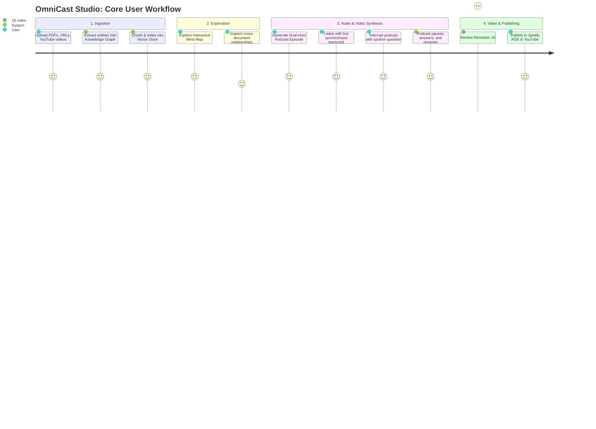

# 📄 Product Requirements Document (PRD)
## Project: OmniCast Studio
**Document Version:** 1.0.0  
**Target Release:** Q4 2026  
**Status:** Approved / Spec-Driven  
**Owner:** Product & AI Systems Architecture  

---

## 1. Executive Summary & Vision

**OmniCast Studio** is an open-source, enterprise-grade multimodal research, synthesis, and broadcast platform. It bridges the gap between dense, static textual knowledge (PDFs, research publications, technical documentation, codebases, and web articles) and dynamic, accessible media (interactive concept mind maps, multi-speaker conversational podcasts, automated video overviews, and sub-300ms bidirectional voice chat).

Unlike existing single-modality tools (e.g., audio-only or text-only assistants), OmniCast Studio provides a **deeply grounded, cross-linked multimodal workspace** where every spoken audio sentence, video slide card, and mind map node links directly back to exact citations in the uploaded source material.

---

## 2. Target Personas & Use Cases

| Persona | Primary Goal | Pain Point Addressed | Key Feature Used |
| :--- | :--- | :--- | :--- |
| **Dr. Elena Chen** *(Senior AI Researcher)* | Rapidly digest 10–20 new arXiv papers weekly. | Dense math and repetitive methodology make reading exhausting. | **2-Host Deep-Dive Podcast** (listening during commutes) + **Interactive Mind Map** (visualizing cross-paper contradictions). |
| **Marcus Vance** *(VP of Engineering / CTO)* | Review 60-page architectural PRDs and RFP vendor proposals. | Limited calendar time to read dense specs line-by-line. | **60-Second Executive Audio Brief** + **Voice Q&A** ("Interrupt & Ask" to drill down into database schema trade-offs). |
| **Sophia Martinez** *(Tech Content Creator & Educator)* | Produce weekly educational videos and podcasts on tech trends. | Scripting, dual-voice recording, and editing takes 20+ hours per episode. | **Remotion Video Generator** (16:9 YouTube + 9:16 Shorts) + **1-Click Apple Podcasts/Spotify Syndication**. |
| **David O'Connor** *(Corporate Legal Counsel)* | Abstract covenants and termination liabilities across commercial contracts. | Keyword searches miss cross-clause implications. | **Graph RAG Multi-Hop Querying** + **Verifiable Page-Level Citation Links**. |

---

## 3. Core User Journeys

---

## 4. Functional Requirements (MoSCoW Framework)

### Must Have (P0 — Core MVP)
* **FR-01: Multimodal Source Ingestion:** Support for PDF parsing, raw text/Markdown, web URLs, and YouTube video transcripts with automated token accounting.
* **FR-02: Graph RAG Entity & Relation Extraction:** Automated extraction of entities (`Concept`, `Methodology`, `Person`, `Metric`) and edges (`EXTENDS`, `CONTRADICTS`, `DEPENDS_ON`) into a GraphDB.
* **FR-03: Dual-Host Podcast Dialogue Generation:** Autonomous 2-host conversational scripting powered by Gemini 3.8 Flash with distinct host personalities, realistic banter, interruptions, and pacing.
* **FR-04: Neural Audio Synthesis & Mastering:** Multi-speaker neural TTS (Kokoro-82M ONNX / Cartesia) with stereo panning and EBU R128 loudness normalization (-16 LUFS).
* **FR-05: Real-Time Full-Duplex Voice Chat:** Sub-300ms bidirectional voice communication via AudioWorklet and Gemini Multimodal Live API with instant speech cutoff upon user barge-in.
* **FR-06: Verifiable Citation Anchors:** Every generated dialogue turn and mind map node must reference the source document ID, page number, and text snippet.

### Should Have (P1 — Production Polish)
* **FR-07: Interactive Concept Mind Map:** Dynamic React Flow canvas displaying GraphDB entities with hierarchical clustering and pan/zoom controls.
* **FR-08: Programmatic Video Generation (Remotion):** Automatic compilation of 16:9 widescreen YouTube walkthroughs and 9:16 vertical Shorts with audio-reactive waveforms and kinetic subtitles.
* **FR-09: One-Click Podcast Syndication:** Generation of standards-compliant RSS 2.0 feeds with iTunes/Spotify podcast tags and audio enclosures.
* **FR-10: "Interrupt & Ask" Mode:** Pausing the active podcast playback when the user activates their microphone, answering the question in voice, and resuming playback.

### Could Have (P2 — Advanced Extensions)
* **FR-11: Custom Host Personality Studio:** Sliders for host skepticism, technical depth, humor frequency, and conversation pacing.
* **FR-12: YouTube Direct Upload:** OAuth2 integration to upload Remotion-rendered videos directly to a user's YouTube channel with auto-generated chapters and SEO descriptions.
* **FR-13: Anki Flashcard Export:** Automated extraction of high-yield study cards (.apkg) from ingested documents.

### Won't Have (P3 — Out of Scope for v1)
* Real-time 3D photorealistic avatar lip-sync rendering (deferred to v2; v1 focuses on 2D audio-reactive waveforms and kinetic typography).
* Multi-user real-time collaborative document editing (v1 focuses on single-tenant and team workspaces).

---

## 5. Non-Functional Requirements (NFRs)

* **NFR-01 (Voice Latency):** Roundtrip voice response latency $\le 300\text{ms}$ at 50th percentile, $\le 400\text{ms}$ at 95th percentile.
* **NFR-02 (Synthesis Throughput):** 5-minute dual-host podcast audio must render in under 45 seconds.
* **NFR-03 (Reliability & Grounding):** Faithfulness score $\ge 0.90$ on golden benchmark eval suites; zero unverified factual hallucinations.
* **NFR-04 (Frontend Performance):** Initial page load $\le 1.2\text{s}$ (LCP); 60 FPS continuous rendering on the mind map canvas during panning and zooming.
* **NFR-05 (Audio Quality):** 16kHz/24kHz high-fidelity speech with no audible clipping, clicks, or phase cancellation.

---

## 6. Success Metrics & Key Performance Indicators (KPIs)

1. **Groundedness / Faithfulness Rate:** $> 95\%$ of generated statements verified by source citations.
2. **Audio Completion Rate:** $> 80\%$ of generated podcasts listened to past the 75% duration mark.
3. **Voice Interruption Adoption:** $> 40\%$ of active users utilize the "Interrupt & Ask" voice mode during playback.
4. **Time to First Episode:** $< 60\text{ seconds}$ from document upload to playable audio episode.
