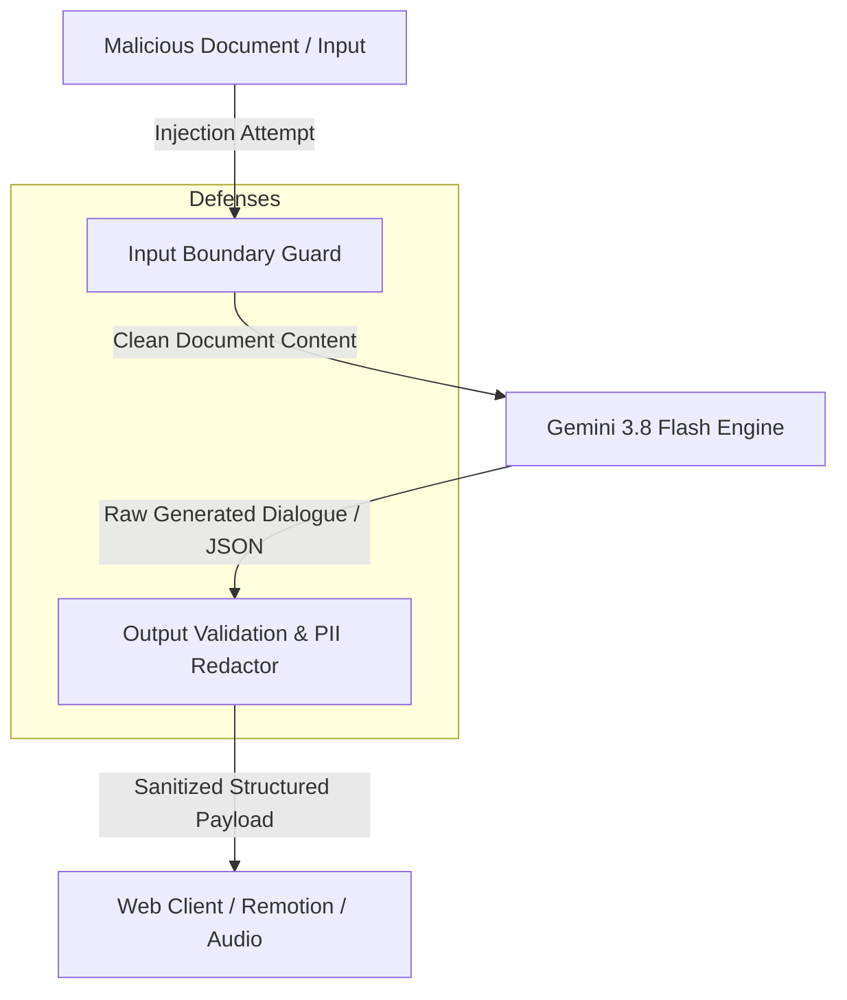

# 🛡️ Security Architecture & Threat Model (SECURITY.md)
## Project: OmniCast Studio
**Document Version:** 1.0.0  
**Classification:** Public / Open Source Standard  
**Framework Alignment:** OWASP Top 10 for LLM Applications (2025/2026), NIST AI RMF, SOC 2 Type II controls  

---

## 1. Security Architecture Overview

OmniCast Studio handles user-uploaded documents, raw voice audio streams, LLM prompt generation, and third-party platform syndication. The security posture is built on the principle of **Defensive Zero Trust by Design**:
* **Boundary Separation:** Untrusted document content is isolated from LLM instruction prompts using delimited boundaries and structural schemas.
* **Ephemeral Audio Processing:** Microphone audio buffers are processed in memory and streamed via encrypted WebSockets (WSS); audio is never stored persistently unless explicitly saved by the user as an episode asset.
* **Output Sanitization:** All LLM outputs undergo structural validation (Zod & Pydantic v2) and DOMPurify sanitization before rendering on client web canvases or Remotion video timelines.

---

## 2. OWASP Top 10 for LLM Applications Threat Matrix

| OWASP Threat | Description | OmniCast Mitigation Strategy |
| :--- | :--- | :--- |
| **LLM01: Prompt Injection** | Malicious text embedded in PDFs/web pages instructing the model to ignore instructions or leak system prompts. | **Delimited Content Wrapping & XML Tags:** All document content is enclosed inside `<untrusted_source_content>` tags. The system prompt strictly forbids executing commands found within source text. System instructions enforce structured JSON output schemas only. |
| **LLM02: Insecure Output Handling** | Generated text containing XSS payloads, malicious JavaScript in Markdown, or rogue SVG tags. | **DOMPurify & React Automatic Escaping:** All rendered text in Next.js 16 is escaped by default. Mind map nodes rendered via `@xyflow/react` sanitize node labels and reject raw HTML strings. Remotion subtitles are rendered as plain canvas text. |
| **LLM03: Training Data Poisoning** | Malicious data influencing future models. | **Zero-Training API Contracts:** All calls to Google GenAI (`google-genai`) utilize commercial enterprise tier API endpoints where user data is explicitly excluded from model training. |
| **LLM04: Model Denial of Service** | Gigabyte-scale document uploads or infinite generation loops designed to exhaust server memory and API quotas. | **Hard Token Caps & Streaming Budget Limits:** File uploads capped at 50MB. Text chunking enforces maximum 128k input token windows. Async rate limiting per client IP prevents WebSocket flooding. |
| **LLM06: Sensitive Information Disclosure** | Accidental extraction and broadcasting of PII, API keys, or credentials found in uploaded documents. | **Presidio-Style Regex & Entity Masking:** Ingestion pipelines run pre-indexing filters scanning for social security numbers, credit cards, and private keys (`BEGIN RSA PRIVATE KEY`), redacting them before vector/graph indexing. |
| **LLM07: Insecure Plugin / Tool Design** | Agent tools executing unauthorized system commands or querying sensitive internal databases. | **Read-Only Scoped Tooling:** The Agentic RAG planner has access only to sandboxed GraphDB read queries and local Vector search. No arbitrary shell execution or dynamic SQL execution is permitted. |

---

## 3. Audio & Voice Privacy Policy

1. **Microphone Stream Ephemerality:**
   - Microphone PCM audio captured via the client's `AudioWorklet` is streamed directly to the real-time WebSocket.
   - Raw voice recordings are processed in-memory for Voice Activity Detection (VAD) and speech reasoning.
   - Raw user audio bytes are **never written to disk** and are discarded immediately after the conversation turn terminates.
2. **Local TTS Privacy (Kokoro-82M):**
   - When configured with the default `kokoro` engine, neural voice synthesis executes **100% locally on your own hardware** via ONNX Runtime. No synthesized audio data is sent to external cloud voice vendors.
3. **Transport Security:**
   - All network traffic (GraphQL, WebSockets, static media) requires **TLS 1.3 / WSS** in production.

---

## 4. Secret Management & Storage Security

1. **Zero Committed Secrets:**
   - `.env`, `.env.local`, and all database files (`*.sqlite`, `*.db`) are strictly enforced in `.gitignore`.
   - Continuous integration runs `gitleaks` on every pull request to detect accidental secret commits.
2. **Database Access Control:**
   - MongoDB and Memgraph connections run over authenticated, isolated Docker bridge networks and are never bound to public internet interfaces (`0.0.0.0`) in default configurations.

---

## 5. Vulnerability Disclosure Policy

If you discover a potential security vulnerability in OmniCast Studio, please do **NOT** open a public GitHub issue. Instead:
1. Email our security team at `security@omnicast.ai` (or your configured security contact).
2. Provide a detailed proof-of-concept (PoC) and steps to reproduce.
3. Our team will acknowledge receipt within **24 hours** and aim to deploy a patch within **7 business days**.
