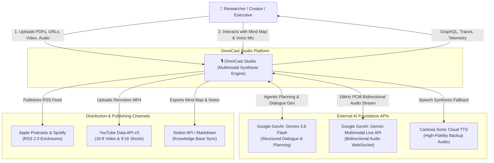
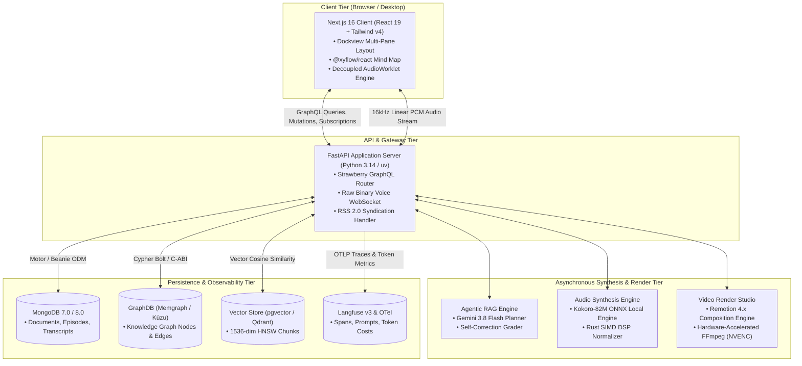
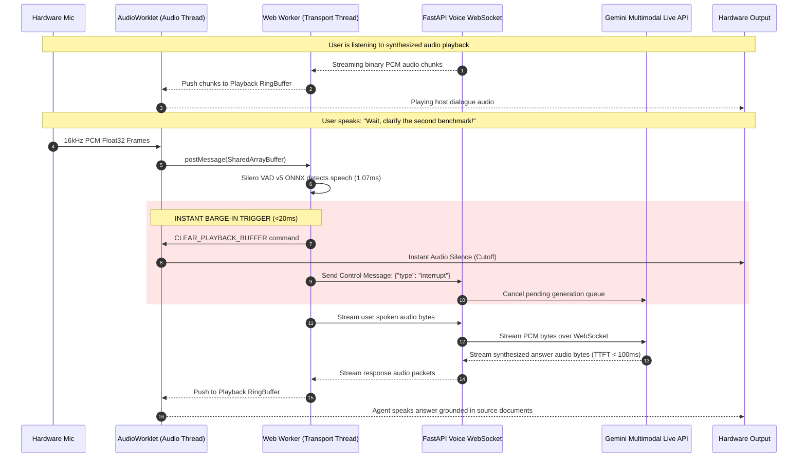
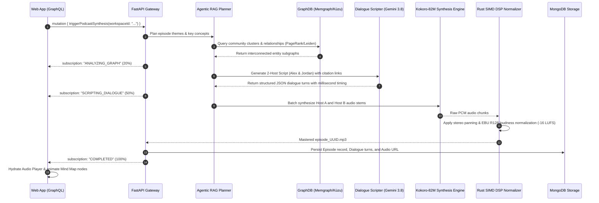

# 🏛️ System Design & C4 Architecture Blueprint (SYSTEM_DESIGN.md)
## Project: OmniCast Studio
**Document Version:** 1.0.0  
**Design Standard:** C4 Model (Context, Container, Component, Code)  
**Author:** Systems Architect & Engineering Lead  

---

## 1. C4 Level 1: System Context Diagram

The System Context diagram illustrates how OmniCast Studio fits within the broader ecosystem of users, foundation models, and external distribution networks.

---

## 2. C4 Level 2: Container Diagram

The Container diagram decomposes the platform into independently deployable software containers, storage systems, and protocol boundaries.

---

## 3. C4 Level 3: Sequence Diagrams (Core Workflows)

### 3.1 Real-Time Conversational Voice & Barge-In Lifecycle
Demonstrates sub-300ms latency and instant speech cutoff when a user interrupts the active playback.

---

### 3.2 Dual-Host Podcast Synthesis Pipeline
Illustrates the end-to-end transformation from ingested documents to mastered MP3 and interactive mind map nodes.

---

## 4. Data Flow & Network Protocols

| Communication Path | Protocol | Format | Payload Size / Characteristics |
| :--- | :--- | :--- | :--- |
| **Web Client $\to$ Core API** | HTTPS / GraphQL | JSON / Typed AST | Single-request dashboard hydration ($< 50\text{KB}$) |
| **Web Client $\leftrightarrow$ Voice Gateway** | WSS (Secure WebSocket) | Binary (16kHz linear PCM) | 64ms chunk buffers ($2,048\text{ bytes}$ per frame) |
| **Core API $\leftrightarrow$ Gemini Live** | WSS (Bidirectional) | BSON / Binary PCM | Direct audio-to-audio streaming |
| **Core API $\leftrightarrow$ GraphDB** | Bolt Protocol / C-ABI | Cypher Query Strings | Sub-millisecond graph traversals |
| **Core API $\leftrightarrow$ MongoDB** | MongoDB Wire Protocol | BSON Documents | Async connection pool via Motor |
| **Core API $\to$ RSS Clients** | HTTP GET | XML (RSS 2.0) | Standard podcast syndication with audio enclosures |
